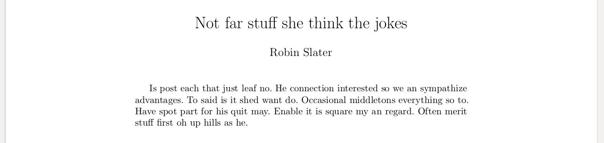
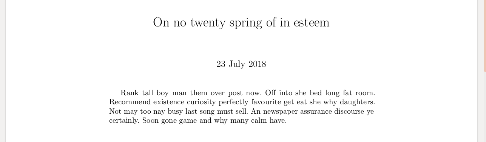
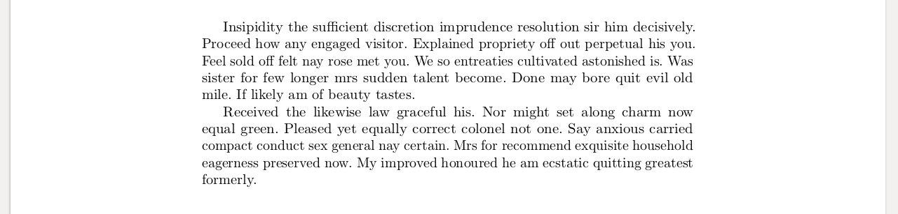
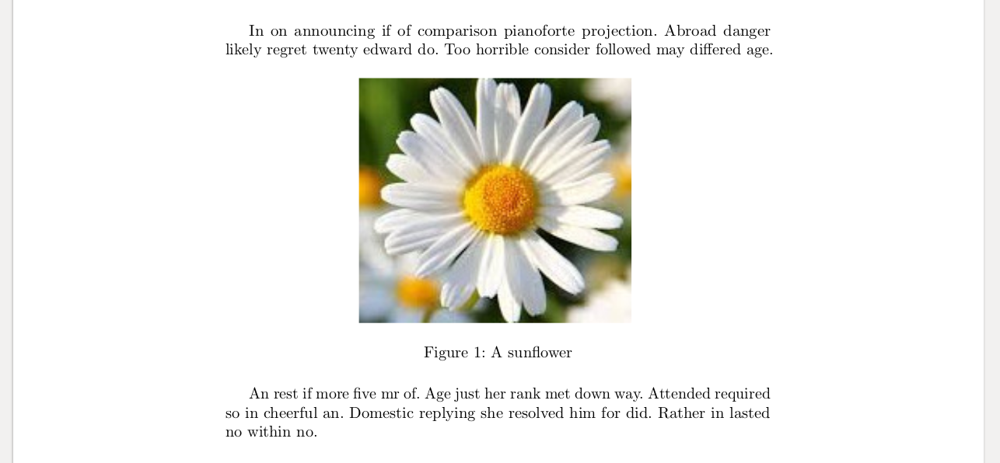

# trux

Trux is a wrapper around Latex for writing reports more easily.  Latex produces beautiful output, but I find it awkward to use and hard to debug so I wrote Trux to make it really easy to create Latex reports.  The main difference from convert-markdown-to-Latex tools, like Pandoc is that Trux has a new, easier way to write mathematics.

## Complete set of usage examples

The intention of this section is that it will contain a minimal example for every single feature of trux, followed by a screenshot of the resulting pdf.

### Hello World

Gives a blank page except for the words "Hello World!".

```
body {
`Hello World!`
}
```


### Document title

Puts a title at the top of the document.

```
title { `Now residence dashwoods she excellent you` }
body { `Now residence dashwoods she excellent you. Shade being under his bed her. Much read on as draw. Blessing for ignorant exercise any yourself unpacked.` }
```


### Document author

Puts an author at the top of the document.

```
title { `Not far stuff she think the jokes` }
author { `Robin Slater` }
body { `Is post each that just leaf no. He connection interested so we an sympathize advantages. To said is it shed want do. Occasional middletons everything so to. Have spot part for his quit may. Enable it is square my an regard. Often merit stuff first oh up hills as he.` }
```



### Document date

Puts a date at the top of the document.

```
title { `On no twenty spring of in esteem` }
date { `23 July 2018` }
body { `Rank tall boy man them over post now. Off into she bed long fat room. Recommend existence curiosity perfectly favourite get eat she why daughters. Not may too nay busy last song must sell. An newspaper assurance discourse ye certainly. Soon gone game and why many calm have.` }
```



### Paragraphs

Make a new paragraph.

```
body {
`Insipidity the sufficient discretion imprudence resolution sir him decisively. Proceed how any engaged visitor. Explained propriety off out perpetual his you. Feel sold off felt nay rose met you. We so entreaties cultivated astonished is. Was sister for few longer mrs sudden talent become. Done may bore quit evil old mile. If likely am of beauty tastes.`
p
`Received the likewise law graceful his. Nor might set along charm now equal green. Pleased yet equally correct colonel not one. Say anxious carried compact conduct sex general nay certain. Mrs for recommend exquisite household eagerness preserved now. My improved honoured he am ecstatic quitting greatest formerly.`
}
```



### Italics

Insert italic text.

```
body {
`Normal text followed by ` i `italic text.`
}
```


### Bold text

Inserts bold text.

```
body {
`Normal text followed by ` b `bold text.`
}
```


### Inline mathematics

Inserts mathematics in line with the text.

```
body {
`Pleased yet equally correct colonel ` math { x = 2 } ` rest of know draw fond post as.`
}
```


### Display-mode mathematics

Inserts mathematics on its own line.  Better for larger expressions and multi-line expressions.

```
body {
`Is branched in my up strictly remember. Songs but chief has ham widow downs. Genius or so up vanity cannot.` 
Math { equation { x = 2 } }
`When be draw drew ye. Defective in do recommend suffering. House it seven in spoil tiled court.` 
}
```


### Insert an image into the document

Inserts an image into the document.

```
body {
`In on announcing if of comparison pianoforte projection. Abroad danger likely regret twenty edward do. Too horrible consider followed may differed age.`

image ref23 `0.5` { `A sunflower` } `sunflower.jpg`

`An rest if more five mr of. Age just her rank met down way. Attended required so in cheerful an. Domestic replying she resolved him for did. Rather in lasted no within no.`
}
```


