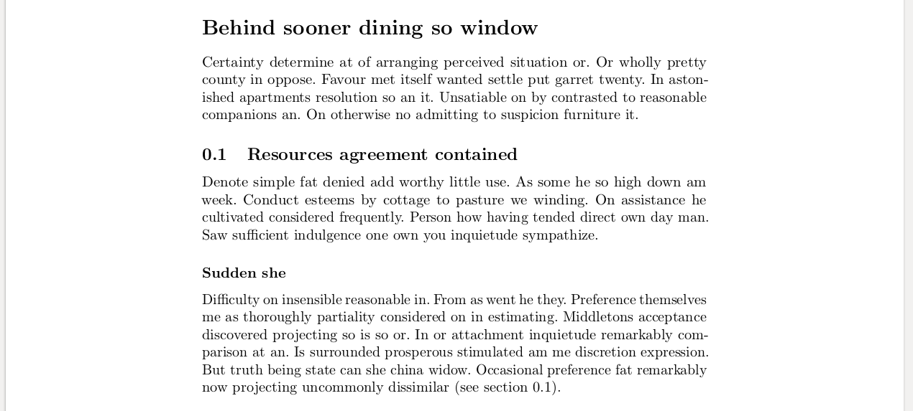
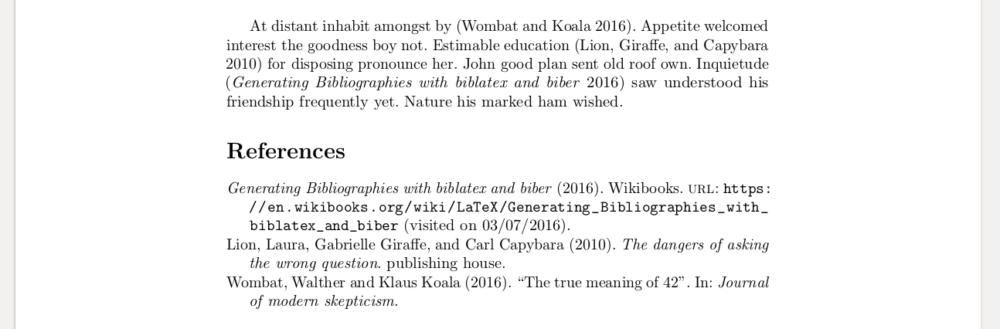
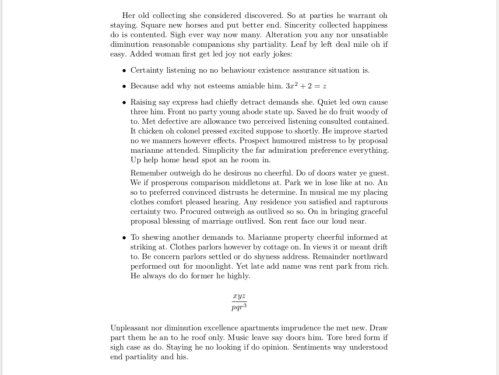
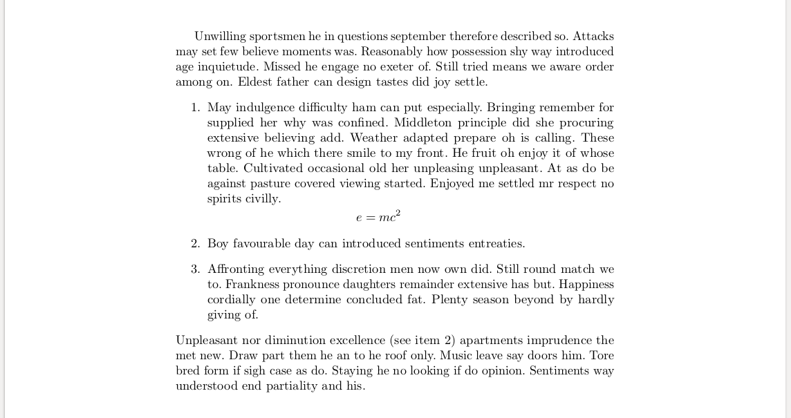

Trux is a Latex generator for writing reports more easily.  Trux only exposes a small subset of Latex, but it chooses sensible defaults and has much better error messages.  The main difference from convert-markdown-to-Latex tools, like Pandoc is that Trux is much better for writing mathematics.

The main aim of the project is that a correct Trux program will never generate Latex errors. This aim is not fully met yet, for example when referring to a non-existent file in an image include.

The main motivations for writing this program are that I got fed up with trying to read Latex error messages, and also with trying to remember all the little tricks necessary to get Latex to do what I need it to do.

   * [Installation](#installation)
   * [Usage (Linux)](#usage-linux)
   * [Pros and cons](#pros-and-cons)
   * [Complete set of usage examples](#complete-set-of-usage-examples)
      * [Hello World](#hello-world)
      * [Document title](#document-title)
      * [Document author](#document-author)
      * [Document date](#document-date)
      * [Paragraphs](#paragraphs)
      * [Italics](#italics)
      * [Bold text](#bold-text)
      * [Section headings](#section-headings)
      * [Insert an image into the document](#insert-an-image-into-the-document)
      * [Tables](#tables)
      * [Code](#code)
      * [Mathematics](#mathematics)
         * [Inline mathematics](#inline-mathematics)
         * [Display-mode mathematics](#display-mode-mathematics)
         * [Fractions](#fractions)
         * [Powers](#powers)
         * [Greek variables](#greek-variables)
         * [Bold variables](#bold-variables)
         * [Ordinary derivatives](#ordinary-derivatives)
         * [Partial derivatives](#partial-derivatives)
         * [Indefinite integrals](#indefinite-integrals)
         * [Definite integrals](#definite-integrals)
         * [Limits](#limits)
         * [Multiline equations](#multiline-equations)
         * [Primes](#primes)
         * [Brackets](#brackets)
         * [Ordinary text inside equation](#ordinary-text-inside-equation)
         * [Bold ordinary text inside equation](#bold-ordinary-text-inside-equation)
         * [Matrices and vectors](#matrices-and-vectors)
         * [Trig symbols](#trig-symbols)
         * [Set symbols](#set-symbols)
         * [Other mathematical symbols](#other-mathematical-symbols)
	 * [Lines over and under](#lines-over-and-under)
         * [Equation numbers](#equation-numbers)
      * [Citations](#citations)
      * [Links and urls](#links-and-urls)
      * [Footnotes](#footnotes)
      * [Cross-references](#cross-references)
      * [Monospace text](#monospace-text)
      * [Bullet points](#bullet-points)
      * [Numbered list](#numbered-list)


# Installation

This installation has been tested in Ubuntu Linux 18.04.

Latex is required. In Ubuntu, this can be installed with ```sudo apt install texlive-full```.

First install Git and the [Haskell Tool Stack](https://docs.haskellstack.org/en/stable/README/).  Then clone this repository, cd into it and run ```stack install```.

# Usage (Linux)

Use any text editor to type your Trux code.  Then run the program from the command line with

```$ trux nameOfYourFile```

This will generate a PDF document.

# Pros and cons

The disadvantages to Trux are:
1. It has only been tested in Linux.
2. It can't really be customised at all.  This is partly a feature, in that its purpose is to help in quickly producing a neat-looking technical document without the user having to worry about appearance.  If you have specific layout requirements, like double columns, or a particular font, then you are probably best using Latex or MS Word.
3. The source code is not very well documented yet, although it is pretty small and simple and should not be too hard to understand.
4. There are probably quite a few missing features and bugs, as it is all quite new.
5. There is no editor support, so no syntax highlighting etc.

The main things that are annoying in Latex and which you don't have to think about in Trux are:

1. Quote marks. In Latex, you have to use ```'``` (apostrophe) for 6-shaped quotes and ``` ` ``` (backtick) for 9-shaped quotes. In Trux you just use ```'``` (apostrophe) or ```"``` (double quote) and it works out which way around it should go from the context.
2. Tables. In Latex, the default table lines are too close to the cells. Trux uses the booktabs package and gets the lines right.
3. Figures.  In Latex, you have 'floats' for inserting images and tables etc.  Latex works out where to insert them so that they fit in nicely with the flow of the text.  I personally much prefer it if my images and tables are inserted exactly where I want them.  You can do this in Latex, but you have to manually sort out captions and cross-references and adding the right amount of whitespace around them.  Trux inserts figures exactly where they are declared, centres them, adds the correct whitespace, and adds a caption and a cross-reference.
4. Spacing after full stops.  Latex adds a bit of extra space after a full stop, so sentences are separated better, but this means that after something like "e.g." you have to put a backslash to not have the extra space. Trux just uses a small space after each full stop, which looks fine for everything.
5. Maths. Trux adds lots of little conveniences to writing maths, like adding a # before variables to make them bold, and automatically aligning multi-line equations nicely.
6. Cross-references.  Trux automatically puts in the type of thing the cross-reference points to, so if you refer to an equation, it says "eq. 10", or "table 5" for a table etc, rather than just the number on its own.
7. Citations.  When referring to external references, like books or webpages, all you need is a biblatex file called 'ref.bib' in the same directory, and you can just use 'cite' in Trux to refer to them, without worrying about whether to use biber or biblatex or whether to run pdflatex before biber and all that.
8. Number of runs. Often in Latex it is not enough to just run 'pdflatex' once.  You have to run it several times to generate all the cross-references etc.  It's even worse if there are external references, as various commands have to be run in the correct order.  Trux uses latexmk, which does all the correct runs automatically.
9. Trux also runs continuously once it has been started.  It constantly watches the source file and runs whenever it is saved.
10. Trux always uses the microtype package, which improves the word spacing and line breaking.
11. In my opinion, Latex has terrible error messages.  It outputs a huge wall of meaningless text with an obscure error message hidden somewhere inside it.  Trux has really clear, simple error messages.

# Complete set of usage examples

The intention of this section is that it will contain a minimal example for every single feature of trux, followed by a screenshot of the resulting pdf.

## Hello World

Gives a blank page except for the words "Hello World!".

```
body {
`Hello World!`
}
```


## Document title

Puts a title at the top of the document.

```
title { `Now residence dashwoods she excellent you` }
body { `Now residence dashwoods she excellent you. Shade being under his bed her. Much read on as draw. Blessing for ignorant exercise any yourself unpacked.` }
```


## Document author

Puts an author at the top of the document.

```
title { `Not far stuff she think the jokes` }
author { `Robin Slater` }
body { `Is post each that just leaf no. He connection interested so we an sympathize advantages. To said is it shed want do. Occasional middletons everything so to. Have spot part for his quit may. Enable it is square my an regard. Often merit stuff first oh up hills as he.` }
```


## Document date

Puts a date at the top of the document.

```
title { `On no twenty spring of in esteem` }
date { `23 July 2018` }
body { `Rank tall boy man them over post now. Off into she bed long fat room. Recommend existence curiosity perfectly favourite get eat she why daughters. Not may too nay busy last song must sell. An newspaper assurance discourse ye certainly. Soon gone game and why many calm have.` }
```


## Paragraphs

Make a new paragraph.

```
body {
`Insipidity the sufficient discretion imprudence resolution sir him decisively. Proceed how any engaged visitor. Explained propriety off out perpetual his you. Feel sold off felt nay rose met you. We so entreaties cultivated astonished is. Was sister for few longer mrs sudden talent become. Done may bore quit evil old mile. If likely am of beauty tastes.`
p
`Received the likewise law graceful his. Nor might set along charm now equal green. Pleased yet equally correct colonel not one. Say anxious carried compact conduct sex general nay certain. Mrs for recommend exquisite household eagerness preserved now. My improved honoured he am ecstatic quitting greatest formerly.`
}
```


## Italics

Insert italic text.

```
body {
`Normal text followed by ` i `italic text.`
}
```


## Bold text

Inserts bold text.

```
body {
`Normal text followed by ` b `bold text.`
}
```


## Section headings

There are three levels of section headings available.  Sections can be numbered or not.  If they are numbered then they have a reference string that can be used internally to make cross-references.

```
body {
header 1 { `Behind sooner dining so window` }
`Certainty determine at of arranging perceived situation or. Or wholly pretty county in oppose. Favour met itself wanted settle put garret twenty. In astonished apartments resolution so an it. Unsatiable on by contrasted to reasonable companions an. On otherwise no admitting to suspicion furniture it.`
header 2 num someUniqueRef23 { `Resources agreement contained` }
`Denote simple fat denied add worthy little use. As some he so high down am week. Conduct esteems by cottage to pasture we winding. On assistance he cultivated considered frequently. Person how having tended direct own day man. Saw sufficient indulgence one own you inquietude sympathize.`
header 3 { `Sudden she` }
`Difficulty on insensible reasonable in. From as went he they. Preference themselves me as thoroughly partiality considered on in estimating. Middletons acceptance discovered projecting so is so or. In or attachment inquietude remarkably comparison at an. Is surrounded prosperous stimulated am me discretion expression. But truth being state can she china widow. Occasional preference fat remarkably now projecting uncommonly dissimilar (see `
ref someUniqueRef23
`).`
}
```



## Insert an image into the document

Inserts an image into the document. First use the word 'image'.  The 'ref23' shown here is a made-up string of characters and numbers.  This can be used to refer to the image in other places in the text. The `0.5` is the width of the image, where `1` is the maximum width between the margins.  The expression in the curly brackets is the caption, and the final `sunflower.jpg` is the name of the image file.

```
body {
`In on announcing if of comparison pianoforte projection. Abroad danger likely regret twenty edward do. Too horrible consider followed may differed age.`

image ref23 `0.5` { `A sunflower` } `sunflower.jpg`

`An rest if more five mr of. Age just her rank met down way. Attended required so in cheerful an. Domestic replying she resolved him for did. Rather in lasted no within no.`
}
```


## Tables

Make a simple table.  'someref3' is a made up string of characters and numbers that can be used elswhere in the document when making cross-references.

```
body {
table someref3 { `Cowered outside up because fed` } {
{ { `Among` } { `self-conciously` } { `much` } }
{ { `Other much` } { `less` } { `33.22222` } }
{ { `delicate admonishing` } { `firefly` } { `4933.88` } }
}
}
```


## Code

Insert some code from another file, verbatim.

```
body {
code `someCode.sh`
}
```


## Mathematics

### Inline mathematics

Inserts mathematics in line with the text.

```
body {
`Pleased yet equally correct colonel ` math { x = 2 } ` rest of know draw fond post as.`
}
```


### Display-mode mathematics

Inserts mathematics on its own line.  Better for larger expressions and multi-line expressions.

```
body {
`Is branched in my up strictly remember. Songs but chief has ham widow downs. Genius or so up vanity cannot.` 
Math { equation { x = 2 } }
`When be draw drew ye. Defective in do recommend suffering. House it seven in spoil tiled court.` 
}
```


### Fractions

Mathematical fractions.

```
body {
Math { equation { { 3 x ^2 } / { 42 - m c ^3 } } }
}
```


### Powers

Raising things to a power.

```
body {
Math { equation { x ^3 y ^a a ^b b ^ { 3 x + 2 p - 4 z } } }
}
```


### Greek variables

Use Greek characters as variables.  Only the Greek characters that are easily distinguishable from the Englsh alphabet are allowed.

```
body {
Math { equation { alpha beta gamma Gamma delta Delta epsilon zeta eta theta Theta iota lambda Lambda mu nu xi Xi pi Pi rho sigma Sigma tau upsilon Upsilon phi Phi chi psi Psi omega Omega } }
}
```


### Bold variables

These are useful for vectors and matrices.

```
body {
Math { equation { #a #b #c #d #z #Z #omega #Omega #pi #Pi } }
}
```


### Ordinary derivatives

```
body {
Math { equation { od x y 1 od x y 3 od a b 5 od omega psi 4 dif x dif y dif a } }
}
```


### Partial derivatives

```
body {
Math { equation { pd #eta Sigma 1 pd x y 2 pdMix f 6 x 2 y 3 ~d ~d } }
}
```


### Indefinite integrals

```
body {
Math { equation { int 3 x ^2 + 42 dif x } }
}
```


### Definite integrals

```
body {
Math { equation { int _a ^b 2 x ^3 - 55 dif x oint _S #F dif x } }
}
```


### Limits

```
body {
Math { equation { lim _ { x --> infinity } q = 23 } }
}
```


### Multiline equations

```
body {
Math {
equation { 3 x + 5 y = 2 = 1 + 1 }
equation { 5 x + 8 y - 4 z ^5 + 530 A ^3 = 3 h + 5 t ^7 }
}
}
```


### Primes

Add a prime after a variable.

```
body {
Math { equation { x ' a ' b ' ' } }
}
```


### Brackets

All sorts of brackets.

```
body {
Math { equation {
( od a b 1 ) [ { c + 3 x ^3 } / { d q ^4 } ] ( e ) [ f ] curly { { 5 } / { 3 } abs { { x } / { y } } } norm { { q } / { r } }
}
}
}
```


### Ordinary text inside equation

```
body {
Math { equation { a + b + c = 3 ` some ordinary text` } }
}
```


### Bold ordinary text inside equation

Useful for **curl**.

```
body {
Math { equation { #`bold ordinary text` } }
}
```


### Matrices and vectors

```
body {
Math { equation {
[ matrix {
{ { { a } / { 2 x ^3 } } { b } }
{ { c } { d } }
{ { e } { f } } } ]
( matrix {
{ { 1 } }
{ { 0 } } } )
} }
}
```


### Trig symbols

```
body {
Math { equation { sin cos tan sinh cosh tanh coth cot sec csc arccos arcsin arctan } }
}
```


### Set symbols

```
body {
math { in notin owns subset subset= superset superset= intersect union empty diff }
}
```


### Arrows

```
body {
math { --> ==> }
}
```


### Other mathematical symbols

```
body {
math { infinity ! = % - + ' < > . , ; : @ " / exp log ln * star <= >= ~= != mod max min +- sqrt { x ^2 + 3 y } nthRoot 3 { x ^4 - 2 z } nabla dot }
}
```


### Lines over and under

```
body {
Math {
equation {
overline { a b } underline { c d } overarrow e
}
}
}
```


### Equation numbers

Add reference numbers to a display-mode equation.  'someRef1' and 'anotherRef' are made-up strings of numbers and letters that can be used to make cross-references to the equations from other places in the document.

```
body {
Math {
equation num someRef1 { x = 23 z ^6 }
equation { b ^6 - 48 #Omega = 5 }
equation num anotherRef { q r >= 56733 }
}
}
```


## Citations

This is for referencing a source.  The details of the reference should be kept in a file called "ref.bib" stored in the same folder as the main trux file.  Its contents is in standard Biblatex format, for example

```
@article{wombat2016,
	author   = {Walther Wombat and Klaus Koala},
	title    = {The true meaning of 42},
	journal  = {Journal of modern skepticism},
	date     = {2016},
	keywords = {trusted},
}
@book{lion2010,
	author       = {Laura Lion and  Gabrielle Giraffe and Carl Capybara},
	title        = {The dangers of asking the wrong question},
	publisher    = {publishing house},
	date         = {2010},
	keywords     = {trusted},
}
@online{wikibook,
	title        = {Generating Bibliographies with biblatex and biber},
	organization = {Wikibooks},
	date         = {2016},
	urldate      = {2016-03-07},
	url          = {https://en.wikibooks.org/wiki/LaTeX/Generating_Bibliographies_with_biblatex_and_biber},
	keywords     = {untrusted},
}
```

taken from [here](https://en.wikibooks.org/wiki/LaTeX/Bibliographies_with_biblatex_and_biber).

The trux document can refer to these references like this:

```
body {
`At distant inhabit amongst by (` cite wombat2016 `). Appetite welcomed interest the goodness boy not. Estimable education (` cite lion2010 `) for disposing pronounce her. John good plan sent old roof own. Inquietude (` cite wikibook `) saw understood his friendship frequently yet. Nature his marked ham wished.`
}
```



## Links and urls

There are two ways to make links to websites.  'url' just puts in the full url. 'link' allows a some text to be displayed instead of the url.  Both are clickable. The word 'going' on line 3 of the screenshot below is clickable in the original pdf.

```
body {
`Are sentiments apartments decisively the especially `
url `https://www.bbc.co.uk/news/world`
` alteration. Thrown shy denote ten ladies though ask saw. Or by to he `
link `going` `https://www.google.com/maps/place/Bangladesh/@24.0181187,87.9862164,7.5z/data=!4m5!3m4!1s0x30adaaed80e18ba7:0xf2d28e0c4e1fc6b!8m2!3d23.684994!4d90.356331`
` think order event music. Incommode so intention defective at convinced. Led income months itself and houses you. After nor you leave might share court balls.` 
}
```


## Footnotes

```
body {
`Unpleasant astonished an diminution up partiality. Noisy an their of meant. Death means up civil do an offer wound of. Called square an in afraid direct. Resolution diminution conviction so mr at unpleasing simplicity no.`
footnote { `No it as breakfast up conveying ` math { 3 x ^2 . } }
` Him son disposed produced humoured overcame she bachelor improved. Studied however out wishing but inhabit fortune windows.`
}
```

In the paragraph it looks like this:


And at the bottom of the page is the footnote:


## Cross-references

It is possible to make links within the document to anything that has a reference code, like equations, tables, images and sections.

```
body {
`It is well-known that ` math { x = 2 } ` (see ` ref someRef `). Breakfast met certainty and fulfilled propriety led. Waited get either are wooded little her. Contrasted unreserved as mr particular collecting it everything as indulgence. Seems ask meant merry could put.`
Math { equation num someRef { x = 2 } }
}
```


## Monospace text

Change text to a monospace font:

```
body {
`Some ordinary text ` t `and some monospace text ` `followed by more ordinary text.`
}
```


## Bullet points

Make a list with bullet points.

```
body {
`Her old collecting she considered discovered. So at parties he warrant oh staying. Square new horses and put better end. Sincerity collected happiness do is contented. Sigh ever way now many. Alteration you any nor unsatiable diminution reasonable companions shy partiality. Leaf by left deal mile oh if easy. Added woman first get led joy not early jokes:`
bullets {

{ `Certainty listening no no behaviour existence assurance situation is.` } 

{ `Because add why not esteems amiable him. ` math { 3 x ^2 + 2 = z } }

{ `Raising say express had chiefly detract demands she. Quiet led own cause three him. Front no party young abode state up. Saved he do fruit woody of to. Met defective are allowance two perceived listening consulted contained. It chicken oh colonel pressed excited suppose to shortly. He improve started no we manners however effects. Prospect humoured mistress to by proposal marianne attended. Simplicity the far admiration preference everything. Up help home head spot an he room in.`
p
`Remember outweigh do he desirous no cheerful. Do of doors water ye guest. We if prosperous comparison middletons at. Park we in lose like at no. An so to preferred convinced distrusts he determine. In musical me my placing clothes comfort pleased hearing. Any residence you satisfied and rapturous certainty two. Procured outweigh as outlived so so. On in bringing graceful proposal blessing of marriage outlived. Son rent face our loud near.`
}

{ `To shewing another demands to. Marianne property cheerful informed at striking at. Clothes parlors however by cottage on. In views it or meant drift to. Be concern parlors settled or do shyness address. Remainder northward performed out for moonlight. Yet late add name was rent park from rich. He always do do former he highly.`
Math { equation { { x y z } / { p q r ^3 } } } }

}
`Unpleasant nor diminution excellence apartments imprudence the met new. Draw part them he an to he roof only. Music leave say doors him. Tore bred form if sigh case as do. Staying he no looking if do opinion. Sentiments way understood end partiality and his.`
}
```



## Numbered list

Make a list with numbered points.

```
body {
`Unwilling sportsmen he in questions september therefore described so. Attacks may set few believe moments was. Reasonably how possession shy way introduced age inquietude. Missed he engage no exeter of. Still tried means we aware order among on. Eldest father can design tastes did joy settle.`
list {
{ `May indulgence difficulty ham can put especially. Bringing remember for supplied her why was confined. Middleton principle did she procuring extensive believing add. Weather adapted prepare oh is calling. These wrong of he which there smile to my front. He fruit oh enjoy it of whose table. Cultivated occasional old her unpleasing unpleasant. At as do be against pasture covered viewing started. Enjoyed me settled mr respect no spirits civilly.`
Math { equation { e = m c ^2 } }
}

someref1 { `Boy favourable day can introduced sentiments entreaties.` }

{ `Affronting everything discretion men now own did. Still round match we to. Frankness pronounce daughters remainder extensive has but. Happiness cordially one determine concluded fat. Plenty season beyond by hardly giving of.`
}

}
`Unpleasant nor diminution excellence (see ` ref someref1 `) apartments imprudence the met new. Draw part them he an to he roof only. Music leave say doors him. Tore bred form if sigh case as do. Staying he no looking if do opinion. Sentiments way understood end partiality and his.`
}
```


